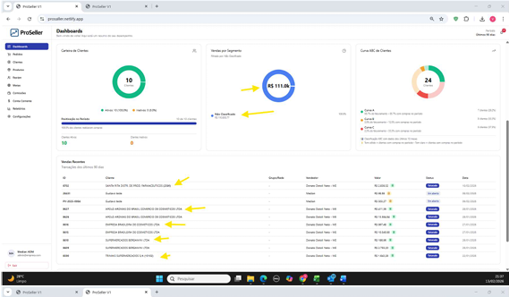
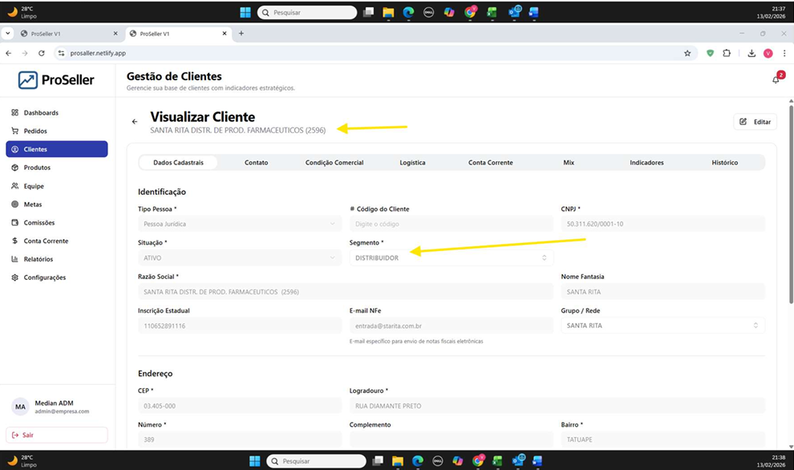

# 📋 Checklist de Ajustes --- ProSeller V1 (Revisão 1)

Documento base: Observações enviadas pelo cliente.\
Inclui referências às evidências visuais (capturas de tela por página do
documento original).

------------------------------------------------------------------------

## 👤 Clientes

### 🔎 Busca de Clientes

-   [ ] Tornar a busca fluida sem travar a tela.
-   [ ] Resultados devem ser refinados conforme digitação.

### 📊 Exportação de Clientes

-   [ ] Preencher corretamente colunas da planilha de exportação.
-   [ ] Incluir coluna de condições de pagamento.

### 🆔 Código do Cliente

-   [ ] Restaurar códigos importados.
-   [ ] Aplicar regra de prioridade (Tiny DAP → Tiny Cântico →
    sequencial).
-   [ ] Garantir não duplicidade.
-   [ ] Considerar toda base Tiny.

### 👥 Cliente Duplicado

-   [ ] Resolver duplicidade Farma Conde (CNPJ com formatação
    diferente).
-   [ ] Consolidar dados entre cadastros.

📸 Evidência visual --- página 5\
Lista de clientes mostrando duplicidade do mesmo cliente.

### 📑 Detalhes do Cliente

-   [ ] Corrigir abas que não abrem (Mix, Indicadores, Histórico) ---
    não prioritário.

### 👤 Lista de Clientes (Vendedor)

-   [ ] Clientes > Lista de Clientes Exibir clientes vinculados ao vendedor
Para o usuário vendedor, a lista de clientes não exibe nenhum cliente. 
Note que o teste foi feito com o usuário do vendedor Donato, que tem clientes vinculados 
a ele..

📸 Evidência visual --- 
Lista vazia para usuário vendedor mesmo com clientes vinculados.

------------------------------------------------------------------------

## 📊 Dashboard

-   [ ] Corrigir classificação incorreta de segmento como "Não
    Classificado".
-   [ ] Corrigir bug também no dashboard do vendedor.

📸 Evidências visuais:
- 
- 
Dashboard mostrando clientes classificados incorretamente por segmento.

------------------------------------------------------------------------

## 🧾 Cabeçalho / Períodos

-   [ ] Corrigir período exibido no cabeçalho da página de Comissões.

📸 Evidência visual --- página 8\
Erro no período exibido no topo da tela.

------------------------------------------------------------------------

## 💰 Comissões

### Admin

-   [ ] Permitir excluir lançamentos.
-   [ ] Criar permissão específica para edição/exclusão.

### Vendedor

-   [ ] Exibir comissões corretamente.
-   [ ] Ajustar seletor de período (mês/ano clicável e digitável).

📸 Evidência visual --- página 7\
Tela de comissões vazia para vendedor.

📸 Evidência visual --- página 8\
Seletor correto no modo backoffice (referência esperada).

------------------------------------------------------------------------

## 🛒 Pedidos

### Inclusão de Pedidos

-   [ ] Fazer SKU 1 aparecer na lista.
-   [ ] Melhorar busca com dropdown pesquisável.

📸 Evidência visual --- página 3\
Lista atual de itens para pedido sem busca eficiente.

### Visualização de Pedido

-   [ ] Corrigir erro ao visualizar detalhes (admin e vendedor).

📸 Evidência visual --- páginas 3 e 6\
Tela de erro ao abrir detalhes do pedido.

------------------------------------------------------------------------

## 📦 Produtos

### Visualização vs Edição

-   [ ] Separar modo visualização do modo edição.
-   [ ] Bloquear edição no modo visualização.
-   [ ] Criar permissão específica para editar.

📸 Evidência visual --- páginas 4 e 6\
Tela de detalhes abrindo diretamente em modo edição.

### Permissões (Vendedor)

-   [ ] Impedir edição de produtos sem permissão.

------------------------------------------------------------------------

## ⚙️ Usuários

-   [ ] Corrigir erro ao buscar usuários.

📸 Evidência visual --- página 4\
Erro ao digitar na busca da lista de usuários.

------------------------------------------------------------------------

## 🔔 Notificações

-   [ ] Usuários devem receber apenas notificações relacionadas a si.
-   [ ] Criar permissões de cadastro e aprovação de clientes.
-   [ ] Ajustar envio de notificações corretamente.

📸 Evidência visual --- página 8\
Notificações recebidas por usuário não relacionado.

------------------------------------------------------------------------

## 📝 Observações Não Prioritárias

-   [ ] Exclusão de lançamentos de comissão.
-   [ ] Abas do cliente com dados zerados.
