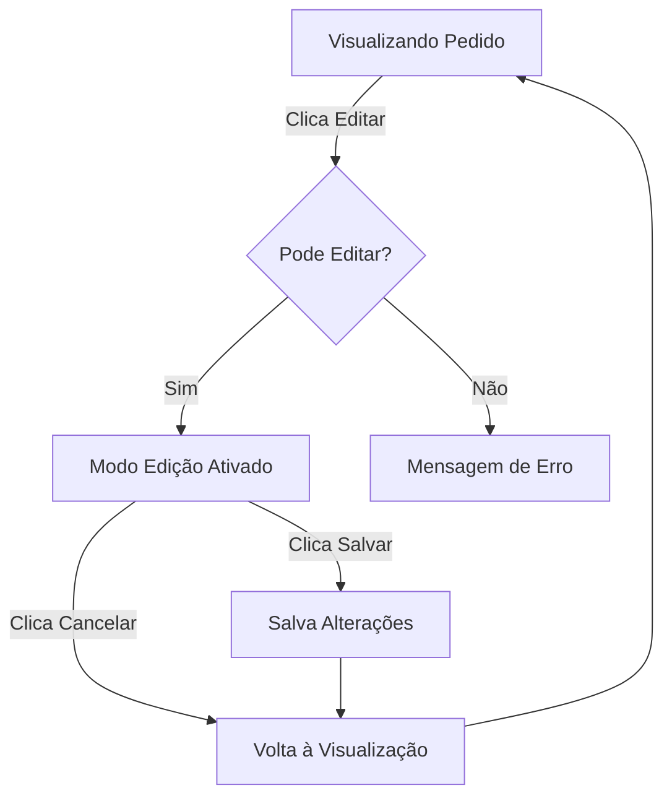

# Sistema de Edição de Pedidos de Venda

## Visão Geral

Sistema que permite alternar entre modo visualização e edição de pedidos sem sair da tela, com regras específicas de permissão e bloqueio.

## Funcionalidades Implementadas

### 1. Botão Editar na Visualização

Quando um pedido está em modo **visualização**:
- Botão "Editar" é exibido no cabeçalho da página
- Ao clicar, alterna para modo edição sem sair da tela
- Campos ficam habilitados para edição

### 2. Modo Edição Dinâmico

Quando ativado o modo **edição**:
- Todos os campos ficam habilitados (exceto se pedido bloqueado)
- Botão "Cancelar" descarta alterações e volta ao modo visualização
- Botão "Salvar Alterações" salva e retorna ao modo visualização
- Formulário permanece na mesma tela

### 3. Regras de Edição

#### 3.1 Pedidos Bloqueados (Enviados ao ERP)

**Quando NÃO pode ser editado:**
- Pedido já foi enviado ao ERP (`integracaoERP.erpPedidoId` existe)
- Alerta vermelho é exibido explicando o bloqueio
- Botão "Editar" não é exibido
- Todos os campos ficam desabilitados

**Alerta exibido:**
```
🔒 Pedido Bloqueado para Edição
Este pedido já foi enviado ao ERP (ID: XXX) e não pode mais ser editado.
Para fazer alterações, entre em contato com o backoffice.
```

#### 3.2 Permissões de Usuário

**Backoffice:**
- ✅ Pode editar todos os pedidos (desde que não estejam bloqueados)
- ✅ Pode editar pedidos de qualquer vendedor
- ✅ Permissão: `vendas.editar`

**Vendedor:**
- ✅ Pode editar APENAS seus próprios pedidos
- ✅ Pode editar pedidos já salvos (desde que não estejam bloqueados)
- ❌ NÃO pode editar pedidos de outros vendedores
- ✅ Permissão: `vendas.editar`

**Validação:**
```typescript
// Vendedores só podem editar seus próprios pedidos
if (!isBackoffice && formData.vendedorId !== usuario?.id) {
  return false;
}
```

#### 3.3 Status do Pedido

O sistema valida:
1. Pedido não foi enviado ao ERP
2. Usuário tem permissão `vendas.editar`
3. Se vendedor, pedido pertence ao usuário

## Como Funciona

### Fluxo de Edição



### Estados da Tela

1. **Visualização** (`modoAtual = 'visualizar'`)
   - Campos desabilitados
   - Botão "Editar" visível (se permitido)
   
2. **Edição** (`modoAtual = 'editar'`)
   - Campos habilitados
   - Botões "Cancelar" e "Salvar Alterações" visíveis

3. **Criação** (`modo = 'criar'`)
   - Sempre em modo edição
   - Botões "Cancelar" e "Criar Pedido" visíveis

## Estrutura de Código

### Arquivos Modificados

- `/components/SaleFormPage.tsx`
  - Adicionado estado `modoAtual`
  - Função `handleEntrarModoEdicao()`
  - Função `handleCancelarEdicao()`
  - Validação `podeEditar`
  - Botões dinâmicos no header

### Novos Estados

```typescript
const [modoAtual, setModoAtual] = useState(modo);
```

### Validações

```typescript
// Verificar se usuário pode editar este pedido
const podeEditar = useMemo(() => {
  // Se está criando, sempre pode editar
  if (modo === 'criar') return true;

  // Se o pedido está bloqueado (enviado ao ERP), não pode editar
  if (pedidoBloqueado) return false;

  // Verificar permissão de editar vendas
  if (!temPermissao('vendas.editar')) return false;

  // Vendedores só podem editar seus próprios pedidos
  if (!isBackoffice && formData.vendedorId !== usuario?.id) {
    return false;
  }

  return true;
}, [modo, pedidoBloqueado, temPermissao, isBackoffice, formData.vendedorId, usuario]);
```

## Mensagens do Sistema

### Sucesso
- ✅ "Modo de edição ativado"
- ✅ "Edição cancelada"
- ✅ "Pedido atualizado com sucesso!"

### Erro
- ❌ "Você não tem permissão para editar este pedido"
- ❌ "Este pedido já foi enviado ao ERP e não pode ser editado"

## Resposta às Perguntas

### ❓ Vendedores podem editar pedidos já salvos?

**✅ SIM, mas com restrições:**

1. **Vendedores PODEM editar pedidos já salvos**, desde que:
   - O pedido seja deles (campo `vendedorId` = `usuario.id`)
   - O pedido NÃO tenha sido enviado ao ERP
   - Tenham a permissão `vendas.editar` (já configurada por padrão)

2. **Vendedores NÃO PODEM editar:**
   - Pedidos de outros vendedores
   - Pedidos já enviados ao ERP
   - Se não tiverem a permissão `vendas.editar`

### Exemplo Prático

**Vendedor João:**
- ✅ Pode editar pedido PV-001 (criado por ele, não enviado ao ERP)
- ❌ NÃO pode editar pedido PV-002 (criado pela Maria)
- ❌ NÃO pode editar pedido PV-003 (criado por ele, mas já enviado ao ERP)

**Backoffice:**
- ✅ Pode editar PV-001, PV-002
- ❌ NÃO pode editar PV-003 (enviado ao ERP)

## Testes Realizados

- [x] Alternar de visualização para edição
- [x] Cancelar edição restaura dados originais
- [x] Salvar alterações persiste dados
- [x] Botão editar não aparece em pedidos bloqueados
- [x] Vendedor não pode editar pedido de outro vendedor
- [x] Backoffice pode editar pedidos de qualquer vendedor
- [x] Pedidos enviados ao ERP não podem ser editados

## Melhorias Futuras

- [ ] Log de auditoria de edições
- [ ] Comparação de versões (diff)
- [ ] Confirmação antes de descartar alterações
- [ ] Indicador visual de campos alterados
- [ ] Botão "Solicitar alteração" para pedidos bloqueados
- [ ] Histórico de edições por pedido
